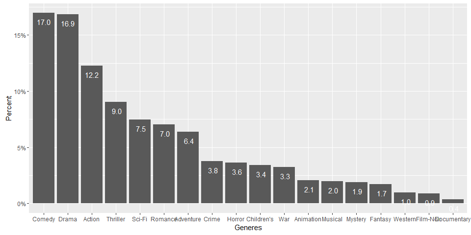
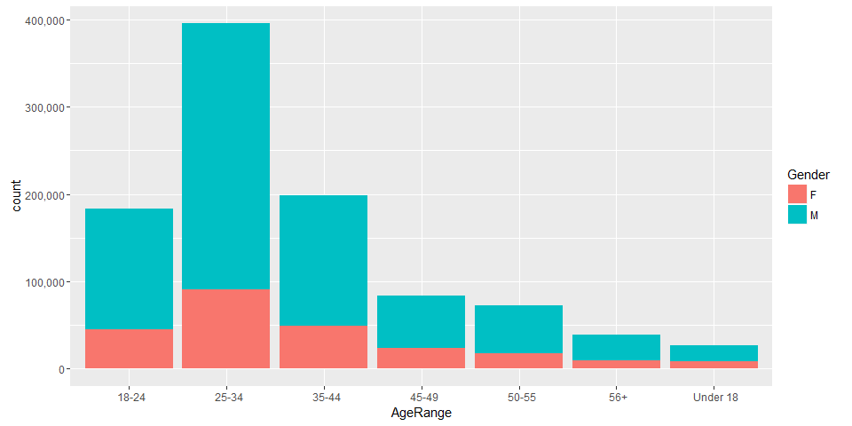
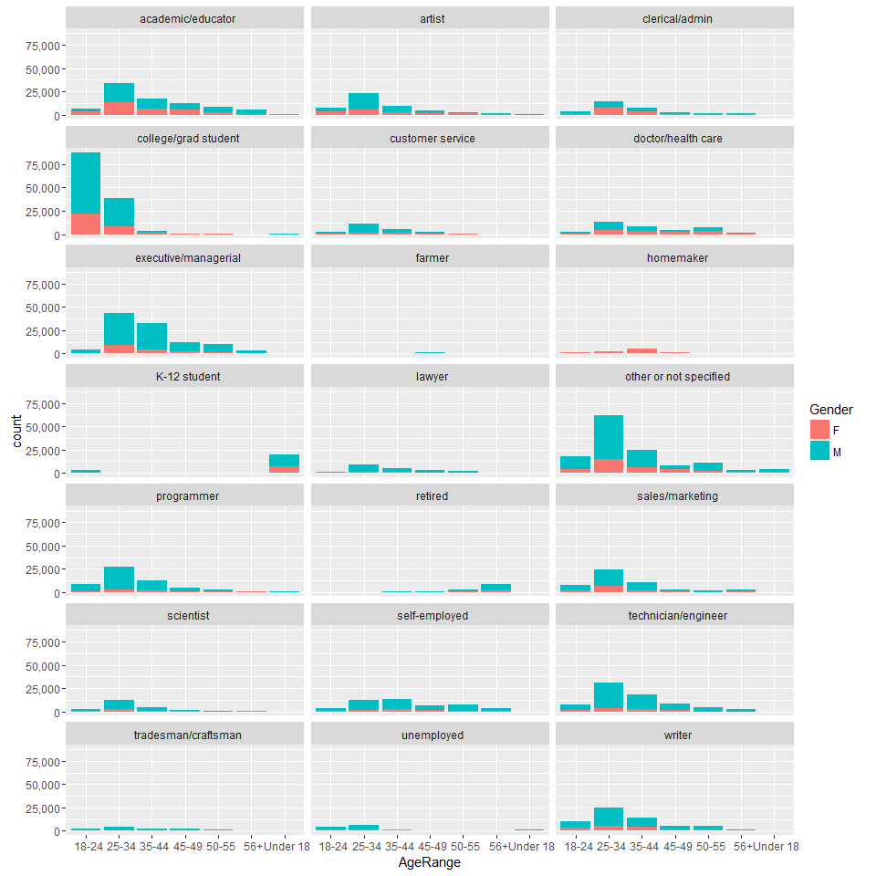
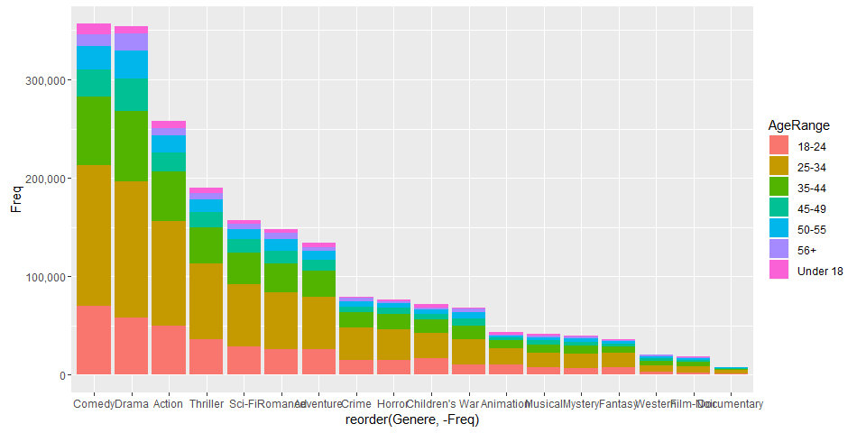
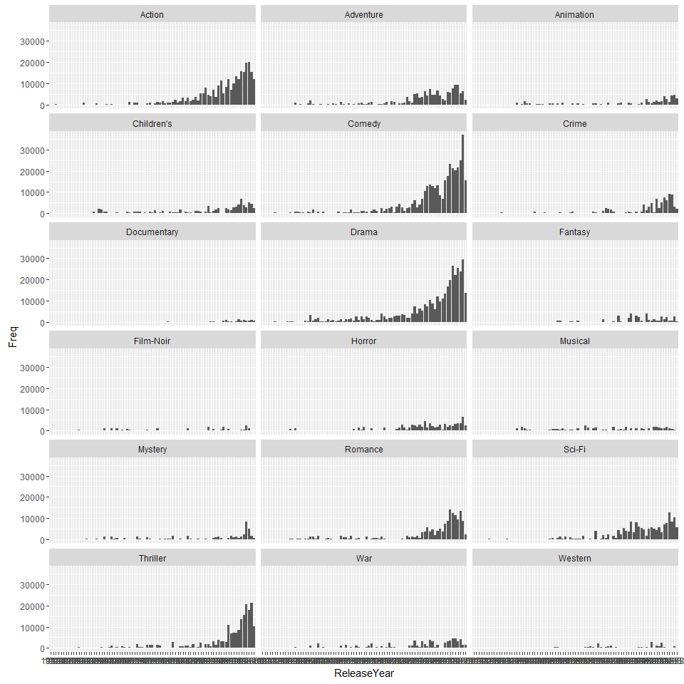
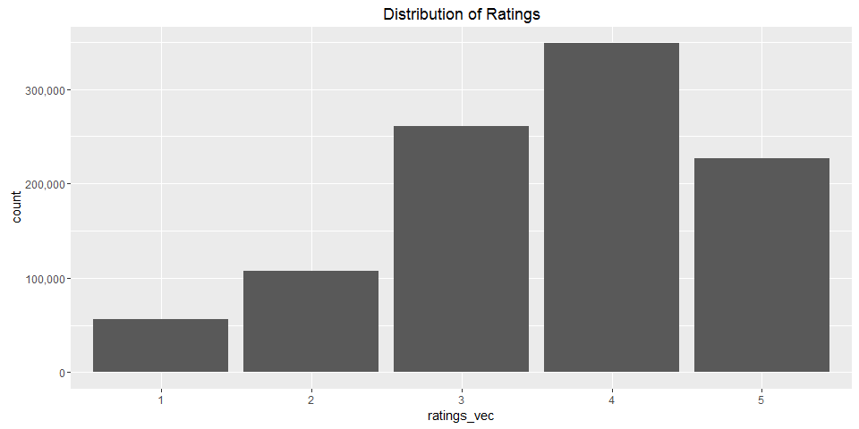
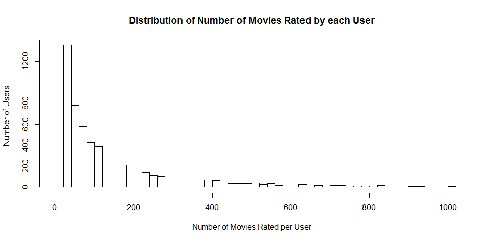
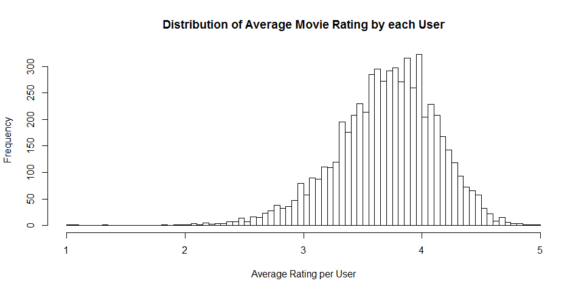

# Movies_Recommender_System: Capstone Project
Manu Kushwaha  
August 11, 2016  


***
### OBJECTIVE/SYNOPSIS

The objective of this project is create a movies recommender system using the recommenderlab package (from CRAN), which utilizes the collaborative filtering methodology to recommend atlest top 5 movies to some target users. The data was downloaded from the MoviesLens site: <http://grouplens.org/datasets/movielens>. The datasets are provided by the GroupLens Research Group. (Please refer to the "READ.ME" file included for endorsements)

The dataset that was chosen is from the "MovieLens 1M Dataset" section and the compressed file name was: "ml-1m.zip".

The structure of the Movie data is such that it does not provide any Movie content information except for Generes, i.e. there is no information about the directors, actors, producers, etc. Hence, content based collaborative filtering methodology in its true form cannot be used here. Ideally, to make a sensible collaborative filtering model, both user and content based filtering methods need to be employed in tandem.

Based on this limitation, the approach is then to utlize the user based collaborative filtering method, which serves 2 main purposes:
  1. finds similarity between ratings of multiple users who are the closest to the target user and predicts ratings for the movies/items that the target user has not rated yet 
  2. provides a list of top-N movies/items recommendations to this user (which they have not yet rated or seen)

***
### ABOUT THE FILES IN THE "MOVIELENS 1M DATASET""

There are 3 data files included in the compressed zip file and these files contain 1,000,209 anonymous ratings of approximately 3,900 movies 
made by 6,040 MovieLens users who joined MovieLens in 2000.

The description and content of these 3 files is given below:

***
#### 1. RATINGS FILE DESCRIPTION

All ratings are contained in the file "ratings.dat" and are in the
following format:

UserID::MovieID::Rating::Timestamp

- UserIDs range between 1 and 6040 
- MovieIDs range between 1 and 3952
- Ratings are made on a 5-star scale (whole-star ratings only)
- Timestamp is represented in seconds since the epoch as returned by time(2)
- Each user has at least 20 ratings

***
#### 2. USERS FILE DESCRIPTION

User information is in the file "users.dat" and is in the following
format:

UserID::Gender::Age::Occupation::Zip-code

All demographic information is provided voluntarily by the users and is
not checked for accuracy.  Only users who have provided some demographic
information are included in this data set.

- Gender is denoted by a "M" for male and "F" for female
- Age is chosen from the following ranges:

	*  1:  "Under 18"
	* 18:  "18-24"
	* 25:  "25-34"
	* 35:  "35-44"
	* 45:  "45-49"
	* 50:  "50-55"
	* 56:  "56+"

- Occupation is chosen from the following choices:

	*  0:  "other" or not specified
	*  1:  "academic/educator"
	*  2:  "artist"
	*  3:  "clerical/admin"
	*  4:  "college/grad student"
	*  5:  "customer service"
	*  6:  "doctor/health care"
	*  7:  "executive/managerial"
	*  8:  "farmer"
	*  9:  "homemaker"
	* 10:  "K-12 student"
	* 11:  "lawyer"
	* 12:  "programmer"
	* 13:  "retired"
	* 14:  "sales/marketing"
	* 15:  "scientist"
	* 16:  "self-employed"
	* 17:  "technician/engineer"
	* 18:  "tradesman/craftsman"
	* 19:  "unemployed"
	* 20:  "writer"

***
#### 3. MOVIES FILE DESCRIPTION

Movie information is in the file "movies.dat" and is in the following
format:

MovieID::Title::Genres

- Titles are identical to titles provided by the IMDB (including
year of release)
- Genres are pipe-separated and are selected from the following genres:

	* Action
	* Adventure
	* Animation
	* Children's
	* Comedy
	* Crime
	* Documentary
	* Drama
	* Fantasy
	* Film-Noir
	* Horror
	* Musical
	* Mystery
	* Romance
	* Sci-Fi
	* Thriller
	* War
	* Western

***
### INITAL OBSERVATIONS ABOUT THE DATA

The format of the data is already provided above and there is, clearly, a need to wrangle it to bring it into a workable form. To confirm whether R sees the same format as above, all the 3 files are read into their respective dataframes. 


```r
# Loading the required libraries
suppressMessages(library(ggplot2))
suppressMessages(library(dplyr))
suppressMessages(library(tidyr))
suppressMessages(library(reshape2))
suppressMessages(library(splitstackshape))
suppressMessages(library(scales))
suppressMessages(library(recommenderlab))
```


```r
## Creating a utility function to perform basic checks on the dataframes
check_df <- function(y, ...){
  
  if(... == 0){
    df_records_count <- sapply(y, function(x) sum(length(x)))
    print("Checking for the total number of records in the dataframe to ensure completeness:")
    cat("\n")
    print(df_records_count)
    cat("\n\n")
    
    df_missing_data <- sapply(y, function(x) sum(length(which(is.na(x)))))
    print("Checking for the total number of missing values (NA) in the dataframe if any:")
    cat("\n")
    print(df_missing_data)
  }
  
  if(... == 1){
    df_records_count <- sapply(y, function(x) sum(length(x)))
    print("Checking for the total number of records in the dataframe to ensure completeness:")
    cat("\n")
    print(df_records_count)
    cat("\n\n")
  }
  
  if(... == 2){
    df_missing_data <- sapply(y, function(x) sum(length(which(is.na(x)))))
    print("Checking for the total number of missing values (NA) in the dataframe if any:")
    cat("\n")
    print(df_missing_data)
  }

}
```

***
Reading in the data from the 3 files.


```r
# reading the movies.dat file
mov_lines <- readLines("movies.dat")
head(mov_lines)
```

```
## [1] "1::Toy Story (1995)::Animation|Children's|Comedy" "2::Jumanji (1995)::Adventure|Children's|Fantasy"  "3::Grumpier Old Men (1995)::Comedy|Romance"      
## [4] "4::Waiting to Exhale (1995)::Comedy|Drama"        "5::Father of the Bride Part II (1995)::Comedy"    "6::Heat (1995)::Action|Crime|Thriller"
```

##### Observations:

  * There is no header information to explain the varibales in the dataset
  * The variables here are seperated by "::"
  * Movie release year is a part of the movie title
  * Generes are seperated using a pipe operator ("|")

***

```r
# reading the users.dat file
usrs_lines <- readLines("users.dat")
head(usrs_lines)
```

```
## [1] "1::F::1::10::48067"  "2::M::56::16::70072" "3::M::25::15::55117" "4::M::45::7::02460"  "5::M::25::20::55455" "6::F::50::9::55117"
```

##### Observations:

  * There is again no header information to explain the varibales in the dataset
  * The variables here are also seperated by "::"
  * Age and Occupation appear as IDs rather than in their meaningful form 

***

```r
# reading the ratings.dat file
ratings_lines <- readLines("ratings.dat")
head(ratings_lines)
```

```
## [1] "1::1193::5::978300760" "1::661::3::978302109"  "1::914::3::978301968"  "1::3408::4::978300275" "1::2355::5::978824291" "1::1197::3::978302268"
```

##### Observations:

  * There is once again no header information to explain the varibales in the dataset
  * The variables here are again seperated by "::"
  * The timestamp needs to be converted into a meaningful date format

***
### DATA WRANGLING APPROACH

Clearly, the data needs to be formatted properly to bring it into a workable form. The idea here is to combine the 3 datasets to create one complete movies dataframe which contains all the information provided in these seperate files.

In order to do so, the following approach is undertaken:

For the movies (mov_lines) dataset:

  1. The "::" seperator needs to be removed
  2. Header information needs to be input to give meaningful names to the variables (data columns)
  3. The movie release year needs to be seperated from the movie title variable and a new ReleaseYear variable needs to be created
  4. Similarly, the Generes need to be seperated and a new Genere variable needs to be created

Hence, implementing the above 4 points...

Addressing point 1 above:

```r
# Transforming the mov_lines into a Matrix and then into a mov_df dataframe
Matrix <- do.call(rbind, strsplit(mov_lines,"::", fixed=TRUE))
mov_df <- as.data.frame(Matrix, row.names = NULL, stringAsFactors = FALSE)
```

Addressing point 2 above:

```r
# From the readme file included, assigning the relevant column/variable names
names(mov_df) <- c("MovieID", "MovieTitle","Genere")

# Checking the first few records of the mov_df dataframe
head(mov_df)
```

```
##   MovieID                         MovieTitle                       Genere
## 1       1                   Toy Story (1995)  Animation|Children's|Comedy
## 2       2                     Jumanji (1995) Adventure|Children's|Fantasy
## 3       3            Grumpier Old Men (1995)               Comedy|Romance
## 4       4           Waiting to Exhale (1995)                 Comedy|Drama
## 5       5 Father of the Bride Part II (1995)                       Comedy
## 6       6                        Heat (1995)        Action|Crime|Thriller
```

```r
tail(mov_df)
```

```
##      MovieID                 MovieTitle         Genere
## 3878    3947          Get Carter (1971)       Thriller
## 3879    3948    Meet the Parents (2000)         Comedy
## 3880    3949 Requiem for a Dream (2000)          Drama
## 3881    3950           Tigerland (2000)          Drama
## 3882    3951    Two Family House (2000)          Drama
## 3883    3952      Contender, The (2000) Drama|Thriller
```

```r
# Running the utility function to check the mov_df dataframe
check_df(mov_df,0)
```

```
## [1] "Checking for the total number of records in the dataframe to ensure completeness:"
## 
##    MovieID MovieTitle     Genere 
##       3883       3883       3883 
## 
## 
## [1] "Checking for the total number of missing values (NA) in the dataframe if any:"
## 
##    MovieID MovieTitle     Genere 
##          0          0          0
```

```r
# checking the structure of the mov_df
str(mov_df)
```

```
## 'data.frame':	3883 obs. of  3 variables:
##  $ MovieID   : Factor w/ 3883 levels "1","10","100",..: 1 1056 2166 3228 3339 3450 3556 3666 3775 2 ...
##  $ MovieTitle: Factor w/ 3883 levels "'burbs, The (1989)",..: 3576 1860 1485 3718 1179 1564 3012 3551 3364 1426 ...
##  $ Genere    : Factor w/ 301 levels "Action","Action|Adventure",..: 146 116 208 186 177 64 208 107 1 38 ...
```

Converting MovieTitle to character so that string operations can be performed to extract the year from the title and MovieID to numeric data type:


```r
# converting MovieTitle to Character
mov_df$MovieTitle <- as.character(mov_df$MovieTitle)
# converting MovieID to numeric vector
#mov_df$MovieID <- as.numeric(mov_df$MovieID)
```

Addressing point 3 above:

```r
# Extracting the release year portion from the MovieTitle variable 
mov_year <- extract_numeric(substr(mov_df$MovieTitle, nchar(mov_df$MovieTitle)-5, nchar(mov_df$MovieTitle)))
mov_title <- substr(mov_df$MovieTitle, 1, nchar(mov_df$MovieTitle)-7)

# Reassigning the data back to the MovieTitle variable without the year
mov_df$MovieTitle <- mov_title

# Creating a Release year column in the mov_df
mov_df$ReleaseYear <- mov_year

# Checking the first few records of the new movive dataframe
head(mov_df)
```

```
##   MovieID                  MovieTitle                       Genere ReleaseYear
## 1       1                   Toy Story  Animation|Children's|Comedy        1995
## 2       2                     Jumanji Adventure|Children's|Fantasy        1995
## 3       3            Grumpier Old Men               Comedy|Romance        1995
## 4       4           Waiting to Exhale                 Comedy|Drama        1995
## 5       5 Father of the Bride Part II                       Comedy        1995
## 6       6                        Heat        Action|Crime|Thriller        1995
```

Addressing Point 4 above:

```r
# split the Genere column to corresponding Generes which are separated by "|"
mov_df <- cSplit(mov_df, "Genere", sep="|")

# checking the first few observatins
head(mov_df)
```

```
##    MovieID                  MovieTitle ReleaseYear  Genere_1   Genere_2 Genere_3 Genere_4 Genere_5 Genere_6
## 1:       1                   Toy Story        1995 Animation Children's   Comedy       NA       NA       NA
## 2:       2                     Jumanji        1995 Adventure Children's  Fantasy       NA       NA       NA
## 3:       3            Grumpier Old Men        1995    Comedy    Romance       NA       NA       NA       NA
## 4:       4           Waiting to Exhale        1995    Comedy      Drama       NA       NA       NA       NA
## 5:       5 Father of the Bride Part II        1995    Comedy         NA       NA       NA       NA       NA
## 6:       6                        Heat        1995    Action      Crime Thriller       NA       NA       NA
```

```r
tail(mov_df)
```

```
##    MovieID          MovieTitle ReleaseYear Genere_1 Genere_2 Genere_3 Genere_4 Genere_5 Genere_6
## 1:    3947          Get Carter        1971 Thriller       NA       NA       NA       NA       NA
## 2:    3948    Meet the Parents        2000   Comedy       NA       NA       NA       NA       NA
## 3:    3949 Requiem for a Dream        2000    Drama       NA       NA       NA       NA       NA
## 4:    3950           Tigerland        2000    Drama       NA       NA       NA       NA       NA
## 5:    3951    Two Family House        2000    Drama       NA       NA       NA       NA       NA
## 6:    3952      Contender, The        2000    Drama Thriller       NA       NA       NA       NA
```

```r
#sapply(mov_df, class)
#sapply(mov_df, function(y) sum(length(which(is.na(y)))))
check_df(mov_df,0)
```

```
## [1] "Checking for the total number of records in the dataframe to ensure completeness:"
## 
##     MovieID  MovieTitle ReleaseYear    Genere_1    Genere_2    Genere_3    Genere_4    Genere_5    Genere_6 
##        3883        3883        3883        3883        3883        3883        3883        3883        3883 
## 
## 
## [1] "Checking for the total number of missing values (NA) in the dataframe if any:"
## 
##     MovieID  MovieTitle ReleaseYear    Genere_1    Genere_2    Genere_3    Genere_4    Genere_5    Genere_6 
##           0           0           0           0        2025        3347        3768        3868        3882
```

From the above 2 outputs, it can be seen that although Generes have been split into 6 different categories, they are not unique. Hence, to fix this:

```r
mdata <- melt(mov_df, id=c("MovieID","MovieTitle","ReleaseYear"))

# Using the utility function to check the mdata dataframe
check_df(mdata, 0)
```

```
## [1] "Checking for the total number of records in the dataframe to ensure completeness:"
## 
##     MovieID  MovieTitle ReleaseYear    variable       value 
##       23298       23298       23298       23298       23298 
## 
## 
## [1] "Checking for the total number of missing values (NA) in the dataframe if any:"
## 
##     MovieID  MovieTitle ReleaseYear    variable       value 
##           0           0           0           0       16890
```

The total number of observations is now 23298 which is: 3883 movies * 6 Generes. This means that there are movies in the dataframe that are repeated and which do not fit into a particular Genere type. Hence, it is safe to remove these records.


```r
# removing records where value is NA which indicates that a movie does not have a genere specified
mdata <- mdata[!is.na(mdata$value),]
#sapply(mdata, function(y) sum(length(which(is.na(y)))))
check_df(mdata, 0)
```

```
## [1] "Checking for the total number of records in the dataframe to ensure completeness:"
## 
##     MovieID  MovieTitle ReleaseYear    variable       value 
##        6408        6408        6408        6408        6408 
## 
## 
## [1] "Checking for the total number of missing values (NA) in the dataframe if any:"
## 
##     MovieID  MovieTitle ReleaseYear    variable       value 
##           0           0           0           0           0
```

Another observation based on the above output indicates that there are now 6408 records where a movie may be repeated across other Generes. Now creating a binary classification for the Generes:

```r
# Createing a 1's column in the mov_df dataframe where 1 indicates that the movie has been classified into certain Genere
mdata$Type <- 1

# Widening the mov_df dataframe to have Generes as variables
mov_df <- dcast(mdata, MovieID + MovieTitle + ReleaseYear ~ value, value.var="Type")

check_df(mov_df, 0)
```

```
## [1] "Checking for the total number of records in the dataframe to ensure completeness:"
## 
##     MovieID  MovieTitle ReleaseYear      Action   Adventure   Animation  Children's      Comedy       Crime Documentary       Drama     Fantasy   Film-Noir      Horror     Musical     Mystery 
##        3883        3883        3883        3883        3883        3883        3883        3883        3883        3883        3883        3883        3883        3883        3883        3883 
##     Romance      Sci-Fi    Thriller         War     Western 
##        3883        3883        3883        3883        3883 
## 
## 
## [1] "Checking for the total number of missing values (NA) in the dataframe if any:"
## 
##     MovieID  MovieTitle ReleaseYear      Action   Adventure   Animation  Children's      Comedy       Crime Documentary       Drama     Fantasy   Film-Noir      Horror     Musical     Mystery 
##           0           0           0        3380        3600        3778        3632        2683        3672        3756        2280        3815        3839        3540        3769        3777 
##     Romance      Sci-Fi    Thriller         War     Western 
##        3412        3607        3391        3740        3815
```

```r
# replacing all NA values with 0
mov_df[is.na(mov_df)] <- 0

# Again checking the first few records of the mov_df
head(mov_df)
```

```
##    MovieID                MovieTitle ReleaseYear Action Adventure Animation Children's Comedy Crime Documentary Drama Fantasy Film-Noir Horror Musical Mystery Romance Sci-Fi Thriller War Western
## 1:       1                 Toy Story        1995      0         0         1          1      1     0           0     0       0         0      0       0       0       0      0        0   0       0
## 2:      10                 GoldenEye        1995      1         1         0          0      0     0           0     0       0         0      0       0       0       0      0        1   0       0
## 3:     100                 City Hall        1996      0         0         0          0      0     0           0     1       0         0      0       0       0       0      0        1   0       0
## 4:    1000                   Curdled        1996      0         0         0          0      0     1           0     0       0         0      0       0       0       0      0        0   0       0
## 5:    1001 Associate, The (L'Associe        1982      0         0         0          0      1     0           0     0       0         0      0       0       0       0      0        0   0       0
## 6:    1002            Ed's Next Move        1996      0         0         0          0      1     0           0     0       0         0      0       0       0       0      0        0   0       0
```

```r
# Checking the structure of the mov_df dataframe
str(mov_df)
```

```
## Classes 'data.table' and 'data.frame':	3883 obs. of  21 variables:
##  $ MovieID    : Factor w/ 3883 levels "1","10","100",..: 1 2 3 4 5 6 7 8 9 10 ...
##  $ MovieTitle : chr  "Toy Story" "GoldenEye" "City Hall" "Curdled" ...
##  $ ReleaseYear: num  1995 1995 1996 1996 1982 ...
##  $ Action     : num  0 1 0 0 0 0 0 1 0 0 ...
##  $ Adventure  : num  0 1 0 0 0 0 0 0 0 0 ...
##  $ Animation  : num  1 0 0 0 0 0 0 0 0 0 ...
##  $ Children's : num  1 0 0 0 0 0 0 0 1 0 ...
##  $ Comedy     : num  1 0 0 0 1 1 0 0 1 0 ...
##  $ Crime      : num  0 0 0 1 0 0 0 0 0 0 ...
##  $ Documentary: num  0 0 0 0 0 0 0 0 0 0 ...
##  $ Drama      : num  0 0 1 0 0 0 1 0 0 1 ...
##  $ Fantasy    : num  0 0 0 0 0 0 0 0 0 0 ...
##  $ Film-Noir  : num  0 0 0 0 0 0 0 0 0 0 ...
##  $ Horror     : num  0 0 0 0 0 0 0 0 0 0 ...
##  $ Musical    : num  0 0 0 0 0 0 0 0 0 0 ...
##  $ Mystery    : num  0 0 0 0 0 0 0 0 0 0 ...
##  $ Romance    : num  0 0 0 0 0 0 0 0 0 0 ...
##  $ Sci-Fi     : num  0 0 0 0 0 0 0 0 0 0 ...
##  $ Thriller   : num  0 1 1 0 0 0 1 1 0 0 ...
##  $ War        : num  0 0 0 0 0 0 0 0 0 0 ...
##  $ Western    : num  0 0 0 0 0 0 0 0 0 0 ...
##  - attr(*, ".internal.selfref")=<externalptr> 
##  - attr(*, "sorted")= chr  "MovieID" "MovieTitle" "ReleaseYear"
```

```r
#sapply(mov_df, class)

# check to see if any punctuation characters are present in the dataframe
sapply(mov_df, function(y) sum(length(grep("[^[:alnum:]]", y))))
```

```
##     MovieID  MovieTitle ReleaseYear      Action   Adventure   Animation  Children's      Comedy       Crime Documentary       Drama     Fantasy   Film-Noir      Horror     Musical     Mystery 
##           0        3228           0           0           0           0           0           0           0           0           0           0           0           0           0           0 
##     Romance      Sci-Fi    Thriller         War     Western 
##           0           0           0           0           0
```

As seen here, the Generes are now all numeric in nature rather than factors as originally obtained. They will need to be converted into factors once the full dataframe is created. Also, as expected, the movie title variable contains punctuation characters which is fine.

***

For the users (usrs_lines) dataset:

  1. The "::" seperator needs to be removed
  2. Header information needs to be input to give meaningful names to the variables (data columns)
  3. Age and Occupation appear as IDs rather than in their meaningful form. Therefore, seperate Age and Occupation dataframes need to be created, containing both AgeID and AgeRange, and, OccupationID and Occupation, and then joined with the users dataframe

Hence, implementing the above 3 points...

Addressing point 1 above:

```r
# Transforming the usrs_lines into a Matrix and then into a usrs_df dataframe
Matrix <- do.call(rbind, strsplit(usrs_lines,"::", fixed=TRUE))
usrs_df <- as.data.frame(Matrix, row.names = NULL, stringAsFactors = FALSE)
```

Addressing point 2 above:

```r
# From the readme file included, assigning the relevant column/variable names
names(usrs_df) <- c("UserID", "Gender", "Age", "OccupationID", "ZipCode")

# checking the first few records of the usrs_df
head(usrs_df)
```

```
##   UserID Gender Age OccupationID ZipCode
## 1      1      F   1           10   48067
## 2      2      M  56           16   70072
## 3      3      M  25           15   55117
## 4      4      M  45            7   02460
## 5      5      M  25           20   55455
## 6      6      F  50            9   55117
```

```r
# checking the structure of the usrs_df
str(usrs_df)
```

```
## 'data.frame':	6040 obs. of  5 variables:
##  $ UserID      : Factor w/ 6040 levels "1","10","100",..: 1 1112 2223 3334 4445 5556 5708 5819 5930 2 ...
##  $ Gender      : Factor w/ 2 levels "F","M": 1 2 2 2 2 1 2 2 2 1 ...
##  $ Age         : Factor w/ 7 levels "1","18","25",..: 1 7 3 5 3 6 4 3 3 4 ...
##  $ OccupationID: Factor w/ 21 levels "0","1","10","11",..: 3 9 8 19 14 21 2 5 10 2 ...
##  $ ZipCode     : Factor w/ 3439 levels "00231","00606",..: 1589 2249 1864 141 1939 1864 295 489 2107 3189 ...
```


```r
# check for special chars in the entire usr_df dataframe, the result will indicate which columns have issues
sapply(usrs_df, function(y) sum(length(grep("[^[:alnum:]]", y))))
```

```
##       UserID       Gender          Age OccupationID      ZipCode 
##            0            0            0            0           66
```

```r
# since Zipcode column is showing 66 non-alphanumeric values, we need to see what these are
head(grep("[^[:alnum:]]", usrs_df$ZipCode, value = TRUE))
```

```
## [1] "98107-2117" "37919-4204" "55337-4056" "55405-2546" "55103-1006" "52570-9634"
```

```r
# since all US Zipcodes are 5 digits, selecting only the LHS values before the "-" (which are 5 digits)
# and replacing them back in the same place
usrs_df$ZipCode <- sub("(\\d{5}).*", "\\1", usrs_df$ZipCode)
```


```r
# changing all columns but Gender to numeric
#usrs_df[, colnames(usrs_df) != "Gender"] <- lapply(usrs_df[, colnames(usrs_df) != "Gender"], as.numeric)

# checking the structure of the usrs_df
str(usrs_df)
```

```
## 'data.frame':	6040 obs. of  5 variables:
##  $ UserID      : Factor w/ 6040 levels "1","10","100",..: 1 1112 2223 3334 4445 5556 5708 5819 5930 2 ...
##  $ Gender      : Factor w/ 2 levels "F","M": 1 2 2 2 2 1 2 2 2 1 ...
##  $ Age         : Factor w/ 7 levels "1","18","25",..: 1 7 3 5 3 6 4 3 3 4 ...
##  $ OccupationID: Factor w/ 21 levels "0","1","10","11",..: 3 9 8 19 14 21 2 5 10 2 ...
##  $ ZipCode     : chr  "48067" "70072" "55117" "02460" ...
```

```r
# checking to see if there is any variation in how the Gender is entered
unique(usrs_df$Gender)
```

```
## [1] F M
## Levels: F M
```

Addressing point 3 above:

  * For this one, 2 new dat files (one containing the age information and the other with occupation data) were manually created. Their format is given below:
  

```r
# creating the ages ref dataframe
age_df <- read.csv("ages.dat", sep = ":", header = FALSE, stringsAsFactors = FALSE, colClasses = c("factor","character"))

# assigning correct header names from the read_me file
names(age_df) <- c("Age", "AgeRange")

# checking the first few records of the age_df
#head(age_df)
age_df
```

```
##   Age   AgeRange
## 1   1   Under 18
## 2  18      18-24
## 3  25      25-34
## 4  35      35-44
## 5  45      45-49
## 6  50      50-55
## 7  56        56+
```

```r
# checking the structure of the age_df
str(age_df)
```

```
## 'data.frame':	7 obs. of  2 variables:
##  $ Age     : Factor w/ 7 levels "1","18","25",..: 1 2 3 4 5 6 7
##  $ AgeRange: chr  "  Under 18" "  18-24" "  25-34" "  35-44" ...
```


```r
# creating the occupation ref dataframe
occup_df <- read.csv("occupation.dat", sep = ":", header = FALSE, stringsAsFactors = FALSE, colClasses = c("factor","character"))

# assigning correct header names from the read_me file
names(occup_df) <- c("OccupationID", "Occupation")

# checking the first few records of the occup_df
#head(occup_df)
occup_df
```

```
##    OccupationID               Occupation
## 1             0   other or not specified
## 2             1        academic/educator
## 3             2                   artist
## 4             3           clerical/admin
## 5             4     college/grad student
## 6             5         customer service
## 7             6       doctor/health care
## 8             7     executive/managerial
## 9             8                   farmer
## 10            9                homemaker
## 11           10             K-12 student
## 12           11                   lawyer
## 13           12               programmer
## 14           13                  retired
## 15           14          sales/marketing
## 16           15                scientist
## 17           16            self-employed
## 18           17      technician/engineer
## 19           18      tradesman/craftsman
## 20           19               unemployed
## 21           20                   writer
```

```r
# checking the structure of the occup_df
str(occup_df)
```

```
## 'data.frame':	21 obs. of  2 variables:
##  $ OccupationID: Factor w/ 21 levels "0","1","10","11",..: 1 2 13 15 16 17 18 19 20 21 ...
##  $ Occupation  : chr  "  other or not specified" "  academic/educator" "  artist" "  clerical/admin" ...
```

Now joining the age_df and the occup_df dataframes with the usrs_df dataframe:


```r
# joining the age_df to the usrs_df by Age
usrs_df <- left_join(usrs_df, age_df, by = "Age")

# joining the occup_df to the usrs_df by OccupationID
usrs_df <- left_join(usrs_df, occup_df, by = "OccupationID")

check_df(usrs_df,0)
```

```
## [1] "Checking for the total number of records in the dataframe to ensure completeness:"
## 
##       UserID       Gender          Age OccupationID      ZipCode     AgeRange   Occupation 
##         6040         6040         6040         6040         6040         6040         6040 
## 
## 
## [1] "Checking for the total number of missing values (NA) in the dataframe if any:"
## 
##       UserID       Gender          Age OccupationID      ZipCode     AgeRange   Occupation 
##            0            0            0            0            0            0            0
```

```r
# checking the structure of the usrs_df
str(usrs_df)
```

```
## 'data.frame':	6040 obs. of  7 variables:
##  $ UserID      : Factor w/ 6040 levels "1","10","100",..: 1 1112 2223 3334 4445 5556 5708 5819 5930 2 ...
##  $ Gender      : Factor w/ 2 levels "F","M": 1 2 2 2 2 1 2 2 2 1 ...
##  $ Age         : Factor w/ 7 levels "1","18","25",..: 1 7 3 5 3 6 4 3 3 4 ...
##  $ OccupationID: Factor w/ 21 levels "0","1","10","11",..: 3 9 8 19 14 21 2 5 10 2 ...
##  $ ZipCode     : chr  "48067" "70072" "55117" "02460" ...
##  $ AgeRange    : chr  "  Under 18" "  56+" "  25-34" "  45-49" ...
##  $ Occupation  : chr  "  K-12 student" "  self-employed" "  scientist" "  executive/managerial" ...
```

```r
# reordering columns
usrs_df <- usrs_df[, c("UserID", "Age", "AgeRange", "Gender", "OccupationID", "Occupation", "ZipCode")]

# checking the first few records of the usrs_df
head(usrs_df,20)
```

```
##    UserID Age   AgeRange Gender OccupationID               Occupation ZipCode
## 1       1   1   Under 18      F           10             K-12 student   48067
## 2       2  56        56+      M           16            self-employed   70072
## 3       3  25      25-34      M           15                scientist   55117
## 4       4  45      45-49      M            7     executive/managerial   02460
## 5       5  25      25-34      M           20                   writer   55455
## 6       6  50      50-55      F            9                homemaker   55117
## 7       7  35      35-44      M            1        academic/educator   06810
## 8       8  25      25-34      M           12               programmer   11413
## 9       9  25      25-34      M           17      technician/engineer   61614
## 10     10  35      35-44      F            1        academic/educator   95370
## 11     11  25      25-34      F            1        academic/educator   04093
## 12     12  25      25-34      M           12               programmer   32793
## 13     13  45      45-49      M            1        academic/educator   93304
## 14     14  35      35-44      M            0   other or not specified   60126
## 15     15  25      25-34      M            7     executive/managerial   22903
## 16     16  35      35-44      F            0   other or not specified   20670
## 17     17  50      50-55      M            1        academic/educator   95350
## 18     18  18      18-24      F            3           clerical/admin   95825
## 19     19   1   Under 18      M           10             K-12 student   48073
## 20     20  25      25-34      M           14          sales/marketing   55113
```

The usrs_df is now complete with all the correct variables in place.

***

For the ratings (ratings_lines) dataset:

  1. The "::" seperator needs to be removed
  2. Header information needs to be input to give meaningful names to the variables (data columns)
  3. The timestamp needs to be converted into a meaningful date and time format

Hence, implementing the above 3 points...

Addressing point 1 above:

```r
# reading the ratings.dat file
Matrix <- do.call(rbind, strsplit(ratings_lines,"::", fixed=TRUE))
ratings_df <- as.data.frame(Matrix, row.names = NULL, stringAsFactors = FALSE)
```

Addressing point 2 above:

```r
# assigning correct header names from the read_me file
names(ratings_df) <- c("UserID", "MovieID", "Rating", "TimeStamp")

# checking the structure of the ratings_df dataframe
str(ratings_df)
```

```
## 'data.frame':	1000209 obs. of  4 variables:
##  $ UserID   : Factor w/ 6040 levels "1","10","100",..: 1 1 1 1 1 1 1 1 1 1 ...
##  $ MovieID  : Factor w/ 3706 levels "1","10","100",..: 190 3375 3616 2504 1375 193 291 1862 3308 3621 ...
##  $ Rating   : Factor w/ 5 levels "1","2","3","4",..: 5 3 3 4 5 3 5 5 4 4 ...
##  $ TimeStamp: Factor w/ 458455 levels "1000006356","1000038811",..: 423354 423369 423366 423352 426162 423376 423367 423353 423376 423355 ...
```

```r
check_df(ratings_df, 0)
```

```
## [1] "Checking for the total number of records in the dataframe to ensure completeness:"
## 
##    UserID   MovieID    Rating TimeStamp 
##   1000209   1000209   1000209   1000209 
## 
## 
## [1] "Checking for the total number of missing values (NA) in the dataframe if any:"
## 
##    UserID   MovieID    Rating TimeStamp 
##         0         0         0         0
```

Addressing point 3 above:

```r
# Changing all columns to numeric data type so that date and time operations can be performed on the timestamp
ratings_df$TimeStamp <- as.numeric(ratings_df$TimeStamp)

# Now epoch or UNIX time is given in the TimeStamp - so extracting the date and time from it
ratings_df$Date <- strftime(as.POSIXct(ratings_df$TimeStamp, origin = "1970-01-01", tz =""),"%Y-%m-%d")
ratings_df$Time <- strftime(as.POSIXct(ratings_df$TimeStamp, origin = "1970-01-01", tz =""),"%H:%M:%S")

# checking the first few records of the ratings_df
head(ratings_df)
```

```
##   UserID MovieID Rating TimeStamp       Date     Time
## 1      1    1193      5    423354 1970-01-05 16:35:54
## 2      1     661      3    423369 1970-01-05 16:36:09
## 3      1     914      3    423366 1970-01-05 16:36:06
## 4      1    3408      4    423352 1970-01-05 16:35:52
## 5      1    2355      5    426162 1970-01-05 17:22:42
## 6      1    1197      3    423376 1970-01-05 16:36:16
```

```r
# checking the structure of the ratings_ds
str(ratings_df)
```

```
## 'data.frame':	1000209 obs. of  6 variables:
##  $ UserID   : Factor w/ 6040 levels "1","10","100",..: 1 1 1 1 1 1 1 1 1 1 ...
##  $ MovieID  : Factor w/ 3706 levels "1","10","100",..: 190 3375 3616 2504 1375 193 291 1862 3308 3621 ...
##  $ Rating   : Factor w/ 5 levels "1","2","3","4",..: 5 3 3 4 5 3 5 5 4 4 ...
##  $ TimeStamp: num  423354 423369 423366 423352 426162 ...
##  $ Date     : chr  "1970-01-05" "1970-01-05" "1970-01-05" "1970-01-05" ...
##  $ Time     : chr  "16:35:54" "16:36:09" "16:36:06" "16:35:52" ...
```

***

To create the full movies dataframe that contains all the users, their ratings and movies information:

  1. The usrs_df and mov_df dataframes will be joined with the ratings_df


```r
# joining the usrs_df with the ratings_df by UserID column
full_mov_df <- left_join(ratings_df, usrs_df, by = "UserID")

# joining the mov_df with the full_mov_df created in the above step by MovieID column
full_mov_df <- left_join(full_mov_df, mov_df, by = "MovieID")
```

```
## Warning in left_join_impl(x, y, by$x, by$y): joining factors with different levels, coercing to character vector
```

```r
# checking the first few records of the full_mov_df
head(full_mov_df)
```

```
##   UserID MovieID Rating TimeStamp       Date     Time Age   AgeRange Gender OccupationID     Occupation ZipCode                      MovieTitle ReleaseYear Action Adventure Animation Children's
## 1      1    1193      5    423354 1970-01-05 16:35:54   1   Under 18      F           10   K-12 student   48067 One Flew Over the Cuckoo's Nest        1975      0         0         0          0
## 2      1     661      3    423369 1970-01-05 16:36:09   1   Under 18      F           10   K-12 student   48067       James and the Giant Peach        1996      0         0         1          1
## 3      1     914      3    423366 1970-01-05 16:36:06   1   Under 18      F           10   K-12 student   48067                    My Fair Lady        1964      0         0         0          0
## 4      1    3408      4    423352 1970-01-05 16:35:52   1   Under 18      F           10   K-12 student   48067                 Erin Brockovich        2000      0         0         0          0
## 5      1    2355      5    426162 1970-01-05 17:22:42   1   Under 18      F           10   K-12 student   48067                   Bug's Life, A        1998      0         0         1          1
## 6      1    1197      3    423376 1970-01-05 16:36:16   1   Under 18      F           10   K-12 student   48067             Princess Bride, The        1987      1         1         0          0
##   Comedy Crime Documentary Drama Fantasy Film-Noir Horror Musical Mystery Romance Sci-Fi Thriller War Western
## 1      0     0           0     1       0         0      0       0       0       0      0        0   0       0
## 2      0     0           0     0       0         0      0       1       0       0      0        0   0       0
## 3      0     0           0     0       0         0      0       1       0       1      0        0   0       0
## 4      0     0           0     1       0         0      0       0       0       0      0        0   0       0
## 5      1     0           0     0       0         0      0       0       0       0      0        0   0       0
## 6      1     0           0     0       0         0      0       0       0       1      0        0   0       0
```

```r
# using the utility function to check for missing values and total data
check_df(full_mov_df, 0)
```

```
## [1] "Checking for the total number of records in the dataframe to ensure completeness:"
## 
##       UserID      MovieID       Rating    TimeStamp         Date         Time          Age     AgeRange       Gender OccupationID   Occupation      ZipCode   MovieTitle  ReleaseYear       Action 
##      1000209      1000209      1000209      1000209      1000209      1000209      1000209      1000209      1000209      1000209      1000209      1000209      1000209      1000209      1000209 
##    Adventure    Animation   Children's       Comedy        Crime  Documentary        Drama      Fantasy    Film-Noir       Horror      Musical      Mystery      Romance       Sci-Fi     Thriller 
##      1000209      1000209      1000209      1000209      1000209      1000209      1000209      1000209      1000209      1000209      1000209      1000209      1000209      1000209      1000209 
##          War      Western 
##      1000209      1000209 
## 
## 
## [1] "Checking for the total number of missing values (NA) in the dataframe if any:"
## 
##       UserID      MovieID       Rating    TimeStamp         Date         Time          Age     AgeRange       Gender OccupationID   Occupation      ZipCode   MovieTitle  ReleaseYear       Action 
##            0            0            0            0            0            0            0            0            0            0            0            0            0            0            0 
##    Adventure    Animation   Children's       Comedy        Crime  Documentary        Drama      Fantasy    Film-Noir       Horror      Musical      Mystery      Romance       Sci-Fi     Thriller 
##            0            0            0            0            0            0            0            0            0            0            0            0            0            0            0 
##          War      Western 
##            0            0
```

```r
# finally, checking the structure of the full_mov_df
str(full_mov_df)
```

```
## 'data.frame':	1000209 obs. of  32 variables:
##  $ UserID      : Factor w/ 6040 levels "1","10","100",..: 1 1 1 1 1 1 1 1 1 1 ...
##  $ MovieID     : chr  "1193" "661" "914" "3408" ...
##  $ Rating      : Factor w/ 5 levels "1","2","3","4",..: 5 3 3 4 5 3 5 5 4 4 ...
##  $ TimeStamp   : num  423354 423369 423366 423352 426162 ...
##  $ Date        : chr  "1970-01-05" "1970-01-05" "1970-01-05" "1970-01-05" ...
##  $ Time        : chr  "16:35:54" "16:36:09" "16:36:06" "16:35:52" ...
##  $ Age         : Factor w/ 7 levels "1","18","25",..: 1 1 1 1 1 1 1 1 1 1 ...
##  $ AgeRange    : chr  "  Under 18" "  Under 18" "  Under 18" "  Under 18" ...
##  $ Gender      : Factor w/ 2 levels "F","M": 1 1 1 1 1 1 1 1 1 1 ...
##  $ OccupationID: Factor w/ 21 levels "0","1","10","11",..: 3 3 3 3 3 3 3 3 3 3 ...
##  $ Occupation  : chr  "  K-12 student" "  K-12 student" "  K-12 student" "  K-12 student" ...
##  $ ZipCode     : chr  "48067" "48067" "48067" "48067" ...
##  $ MovieTitle  : chr  "One Flew Over the Cuckoo's Nest" "James and the Giant Peach" "My Fair Lady" "Erin Brockovich" ...
##  $ ReleaseYear : num  1975 1996 1964 2000 1998 ...
##  $ Action      : num  0 0 0 0 0 1 1 0 0 0 ...
##  $ Adventure   : num  0 0 0 0 0 1 1 0 0 1 ...
##  $ Animation   : num  0 1 0 0 1 0 0 0 1 0 ...
##  $ Children's  : num  0 1 0 0 1 0 0 0 1 1 ...
##  $ Comedy      : num  0 0 0 0 1 1 0 1 0 0 ...
##  $ Crime       : num  0 0 0 0 0 0 0 0 0 0 ...
##  $ Documentary : num  0 0 0 0 0 0 0 0 0 0 ...
##  $ Drama       : num  1 0 0 1 0 0 1 1 0 1 ...
##  $ Fantasy     : num  0 0 0 0 0 0 0 0 0 0 ...
##  $ Film-Noir   : num  0 0 0 0 0 0 0 0 0 0 ...
##  $ Horror      : num  0 0 0 0 0 0 0 0 0 0 ...
##  $ Musical     : num  0 1 1 0 0 0 0 0 1 1 ...
##  $ Mystery     : num  0 0 0 0 0 0 0 0 0 0 ...
##  $ Romance     : num  0 0 1 0 0 1 0 0 0 0 ...
##  $ Sci-Fi      : num  0 0 0 0 0 0 0 0 0 0 ...
##  $ Thriller    : num  0 0 0 0 0 0 0 0 0 0 ...
##  $ War         : num  0 0 0 0 0 0 0 0 0 0 ...
##  $ Western     : num  0 0 0 0 0 0 0 0 0 0 ...
```

The utility function shows that there are 0 NAs in the full_mov_df dataframe.


***
### EXPLORATORY DATA ANALYSIS

The next step is to do some EDA on the full_mov_df dataset. The idea here is to see how the data is distributed and if any insights can be gained into user behaviours. However, since the overall project objective is to look at the user ratings for the movies and recommend top movies, all the other variables in the full_mov_df dataset will not be used.

  1. How the data is distributed out in the dataframe (a plot of count vs generes)

```r
# creating a genere distribution dataframe
genere_dist <- full_mov_df %>% 
  select(Action:Western) %>% 
  summarise_each(funs(sum)) %>% 
  gather(Genere, Freq, Action:Western) %>%
  arrange(desc(Freq))
```

Plotting the genere distribution of the dataset
\

\

The dataset shows a Right skewed distribution, where the Comedy and Drama generes make up a noticable part of the full_mov_df (approx. 35%), followed by Action and Thriller. The other generes appear grouped with similar number of occurances in the dataset (i.e. Scifi, Romance and Adventure seem to have between 5%-7% share each, Crime, Horror, Children's and War seem to be between 2.5%-3.5%, and so forth) 

  2. Gender vs Age distributions - It would be interesting to see how the users are distirbuted across the genders 

```r
ggplot(full_mov_df, aes(AgeRange, fill = Gender)) + geom_bar() + scale_y_continuous(labels = comma)
```

\

It appears that there is a significantly larger portion of male users in the full_mov_df than female users. It appears that the agerange from 18 to 44 makes up the most of the watched movies in the dataset, with 25-34 years of age leading the group. It would make sense as this is the age group where most of us are working in full swing and perhaps carving paths for raising families. As the users grow older, the number of movies watched decreases significantly; again, a not so surprising fact, that people would be busy raising families and enjoying time performaing other activities (outdoor perhaps). 


  3. Occupation Gender and Age distributions together - The idea here is to see if there is any relationship between age, gender and occupations. Perhaps, a particular occupation would house a greater agerange than others, and that in turn might prefer to watch a particular kind of genere.
  

```r
ggplot(full_mov_df, aes(AgeRange, fill = Gender)) + facet_wrap(~Occupation, nrow = 7, ncol = 3) + geom_bar() + scale_y_continuous(labels = comma)
```

\

A few occupations stand out where quite a lot of movies have been watched. A large number of them fall under college/grad student occupation, followed by other or not specified, executive/managerial, technician/engineer and the rest are relatively small proportion. As indicated above, the popular age groups obtained above seem to hold. It makes sense that 18-24 is the range where most people go to college. The gender disribution does not change from before either.

  4. Trends:
  
      * Age, Gender, Occupation vs Generes - to find out a little bit about users' and if a particular agerange has preference on particular generes

```r
age_gndr_occp_genre_dist <- full_mov_df %>%
  select(AgeRange, Gender, Occupation, Action:Western) %>% 
  group_by(AgeRange, Gender, Occupation) %>% 
  summarise_each(funs(sum), Action:Western) %>% 
  gather(Genere, Freq, Action:Western, -c(AgeRange, Gender, Occupation))
```


```r
ggplot(age_gndr_occp_genre_dist, aes(x=reorder(Genere, -Freq), y=Freq, fill= AgeRange)) + geom_bar(stat = "identity") + scale_y_continuous(labels = comma)
```

\

The output does not say much except that 25-34 agerange makes up the largest chunk of the distribution across all the generes. This was also noticed in the above plots.


    * Generes over Release years - to find out if there is there a change/popularity of Generes over time
    

```r
genere_relyear_dist <- full_mov_df %>% select(ReleaseYear, Action:Western) %>% group_by(ReleaseYear) %>% summarise_each(funs(sum), Action:Western)  %>% gather(Genere, Freq, Action:Western, -ReleaseYear)

# plotting the distribution
genere_relyear_dist$ReleaseYear <- as.character(genere_relyear_dist$ReleaseYear)
ggplot(genere_relyear_dist, aes(ReleaseYear, Freq)) + geom_bar(stat = "identity") + facet_wrap(~Genere, nrow = 7, ncol=3)
```

\

It looks like there is not much sensible data present before 1970, to be able to really observe a trend if there way any. 

Refining the plot and taking years from 1970 onwards:

```r
genere_relyear_dist$ReleaseYear <- as.character(genere_relyear_dist$ReleaseYear)
ggplot(subset(genere_relyear_dist, ReleaseYear > "1969"), aes(ReleaseYear, Freq)) + geom_bar(stat = "identity") + facet_wrap(~Genere, ncol=2)
```

\

Here is seems that Drama, Comedy, Action, Thriller and Romance are the generes that gained in popularity over time. The rest of the generes did not exhibit this level of increase.

Lastly, looking to see if there are any generes that may be biased towards higher ratings:

```r
genere_rating_df <- full_mov_df %>% select(UserID, MovieID, Rating, Action:Western) %>% 
  gather(Genere, Yes.No, Action:Western, -c(UserID, MovieID, Rating)) %>% 
  mutate(Rating.Yes.No = Rating * Yes.No) %>% 
  filter(Rating.Yes.No !=0) 
```

```
## Warning in Ops.factor(structure(c(5L, 3L, 3L, 4L, 5L, 3L, 5L, 5L, 4L, 4L, : '*' not meaningful for factors
```

```r
# creating a function to reorder values in descending order
reorder_size <- function(x) {factor(x, levels = names(sort(table(x),decreasing = TRUE)))}

# plotting the distribution
#ggplot(genere_rating_df, aes(x=reorder_size(Genere))) + geom_bar() + facet_grid(Rating.Yes.No ~ .) + scale_y_continuous(labels = comma)
```


#### Note to Amit: We can talk about these charts on Wednesday and whether it makes sense to do any feature engineering.. I am not sure when it comes to collaborative filtering..

***
The recommenderlab package from CRAN (hitherto referred to as "RLp"), will be used going forward, to:
  1. look at the rating behaviours of users through preliminary EDA
  2. pick 2000 users and build a popularity based model to recommend top 5 most popular movies for 20 active users
  3. come up with the top 5 movies for about 20 users. There are some assumptions that have been taken into account

Addressing point 1 above:


```r
# Creating the rating df consisting of UserID, MovieID and Rating columns
usr_mov_rtg_df <- full_mov_df %>% select(UserID, MovieID, Rating)
# checking structure
str(usr_mov_rtg_df)
```

```
## 'data.frame':	1000209 obs. of  3 variables:
##  $ UserID : Factor w/ 6040 levels "1","10","100",..: 1 1 1 1 1 1 1 1 1 1 ...
##  $ MovieID: chr  "1193" "661" "914" "3408" ...
##  $ Rating : Factor w/ 5 levels "1","2","3","4",..: 5 3 3 4 5 3 5 5 4 4 ...
```

In order to use the RLp functionality, the above usr_mov_rtg_df dataframe first needs to be coerced to a "realRatingMatrix". 

```r
rating_rRM <- as(usr_mov_rtg_df,"realRatingMatrix")
rating_rRM
```

```
## 6040 x 3706 rating matrix of class 'realRatingMatrix' with 1000209 ratings.
```

```r
# Looking at the format of rating_rRM
head(as(rating_rRM, "data.frame"))
```

```
##       user item rating
## 1        1    1      5
## 7572     1 1022      5
## 9141     1 1028      5
## 10152    1 1029      5
## 12376    1 1035      5
## 35669    1 1097      4
```


```r
# visualize the ratings_rRM matrix
image(rating_rRM, main = "Raw Ratings")
```

\
There are 6040 users who have rated 3706 movies and contains 1,000,209 ratings (as orginally seen in the full_mov_df). Also note, the RLp automatically creates the user, item and rating columns.

Looking at the rating distribution of the dataset:

```r
hist(getRatings(rating_rRM), breaks = 5, xlab = "Rating", main = "Histogram of Ratings and their Occurances")
```

\

The histogram shows that users might be more biased towards giving ratings between 3 and 4 and not so inclined towards a rating of 1. 5 is also not given as frequently but is more often than 1.

Normalizing the distribution to become more 0 centred:

```r
hist(getRatings(normalize(rating_rRM)), breaks = 100, xlab = "Normalized Rating", main = "Histogram of Normalized Ratings")
```

\

Here, the distribution is closer to that of a normal one (although it seems more right skewed towards the positive side), with interestingly high peaks occuring between 0 and 1.

Looking at the distribution of how many movies each user has rated:

```r
hist(rowCounts(rating_rRM), breaks = 100, xlim = c(0,1000), xlab = "Number of Movies Rated per User", ylab = "Number of Users", main = "Distribution of Number of Movies Rated by each User")
```

\
The plot shows that majority of the users lie in the region where they have rated atleast 20 movies (known fact from the MovieLens dataset), and as the number of movies increase, the users count falls. This makes sense otherwise we would all be glued to the screens watching and rating movies all day long. 


```r
hist(rowMeans(rating_rRM), breaks = 100, xlab = "Average Rating per User", main = "Distribution of Average Movie Rating by each User")
```

\
This again shows that majority of the users have a tendency to rate between 3 and 4, with steep decline when rating 5. The range from 1 to 3 is the lowest, perhaps meaning that users only prefer to watch movies that are rated 3 and above.

Finally, looking at the mean rating per movie:

```r
hist(colMeans(rating_rRM), breaks = 50, xlab = "Average Rating per Movie", main = "Distribution of Average Rating per Movie")
```

\
Here it again shows that most of the movies lie between the rating of 3 and 4, with a few exceptions at 1 and 2.

***
### EDA CONCLUSION

Based on the EDA of the full_mov_df dataset, the following preliminary conclusions can be made:

  1. Out of the 18 Generes available, only about 5-7 of them are of significance and make up 76% of the entire dataset and have gained in popularity over years (i.e. more of these generes were released after 1970). Releases from 1919 to 1969 are not at all significant
  2. Users in the age range from 18 to 44 are the ones who watch the most movies and gender distribution is not significant
  3. Out of the 21 occupations, only about 4 occupations stand out with another 4 at the next level down
  4. Finally, a large portion of movies fall between the ratings of 3, 4 and 5, and these also happen to be for the significant generes identified earlier
  
Hence, if a realiable prediction model were to be built with some level of accuracy, it would make sense to conduct some feature engineering where insignificant variables are dropped; i.e. such as 11 generes, movies released between 1919 to 1969, age groups below 18 and above 44, genders, 13 occupations and ratings of 1 and 2.

For the purpose of this project, the above suggestion will not be employed.

***
### BUILDING THE RECOMMENDER SYSTEM

The recommender system will be built and then validated using the RLp. The steps are outlined below:

  1. The rating_rRM realRatingMatrix created above contains the complete data set. The view of this matrix:

```r
# visualize the ratings_rRM matrix for the 1st 5 users (out of 6040) and 10 items (out of 3706)
as(rating_rRM, "matrix")[1:5,1:10]
```

```
##       1 10 100 1000 1002 1003 1004 1005 1006 1007
## 1     5 NA  NA   NA   NA   NA   NA   NA   NA   NA
## 10    5 NA  NA   NA   NA   NA   NA   NA   NA   NA
## 100  NA NA  NA   NA   NA   NA   NA   NA   NA   NA
## 1000  5 NA  NA   NA   NA   NA   NA   NA   NA   NA
## 1001  4 NA  NA   NA   NA   NA   NA   NA   NA   NA
```
The structure of the matrix is: UserIDs in rows, MovieIDs in the cols and Ratings filling up this matrix. As seen, most of it is filled with NAs. Again, the Rmd output is not showing correctly. The console output would give the correct result.

  2. The User Based Collaborative Filtering model will be created and trained with the first 1000 users. This model noramalizes the data dand computes the cosine similarity between the 1000 users.

```r
# building the recommender for popular items
popular_mod <- Recommender(rating_rRM[1:1000], method = "POPULAR")
popular_mod
```

```
## Recommender of type 'POPULAR' for 'realRatingMatrix' 
## learned using 1000 users.
```

  3. Now using the model to recommend the top 5 most popular items to the next 10 users (i.e. users 1001 to 1010):

```r
# predicting the top 5 items for the 10 users
popular_rec <- predict(popular_mod, rating_rRM[1001:1010], n=5)
#as(popular_rec,"matrix")[,1:10]

#putting the data in a presentable format
popular_mov_rec_df <- data.frame(matrix(nrow = 10, ncol = 5))
rownames(popular_mov_rec_df) <- names(popular_rec@items)[1:10]
for(i in 1:10) {
  for (j in 1:5) {
    popular_mov_rec_df[i, j] <- paste0("m", popular_rec@items[[i]][j])
  }
}
names(popular_mov_rec_df) <- as.character(1:5)
popular_mov_rec_df
```

```
##          1     2     3     4     5
## 19   m3323 m2026 m3205  m617 m2066
## 190  m3234  m194  m192 m2265 m3205
## 1900 m1917 m1641 m3234  m194  m192
## 1901 m1917 m3234 m2265 m2026 m3205
## 1902 m1641 m3234  m194  m192 m3559
## 1903 m3234 m3031 m2194 m3250  m190
## 1904 m3234 m2265 m3323  m617 m2066
## 1905 m1917 m1641  m194  m192 m1026
## 1906 m1641 m3234  m194 m1026 m3559
## 1907 m1917 m1641 m3234  m194  m192
```
The top 5 recommendations for each of the 10 users is given above. There is a problem with this Rmd output (please check the result in the console window by running the code chunk). If the movie names are required, the above dataframe can be semi-joined with the mov_df dataframe.

  4. In order to validate the popular_rec model created above, it needs to be evaluated against the original data (rating_rRM matix). In order to create an evaluation scheme in RLp, the same 1000 users matrix will be split into a 90% chunk (900 users) for training the model and 10% for testing (100 users). For the test set, 20 items per user will be given to the recommender alogrithm (since this is the minimum number of movies each user has rated) while the other will be used to compute the errors. In this model, a rating of 3 or above is considered good. k = 1 in the method signifies a single split of the matrix with no cross validation schemes.


```r
# creating a 90/10 split (known/unknown) evaluation scheme for the 1000 users
(rating1k_es <- evaluationScheme(rating_rRM[1:1000,], method = "split", train = 0.9, k=1, given = 20, goodRating = 3))
```

```
## Evaluation scheme with 20 items given
## Method: 'split' with 1 run(s).
## Training set proportion: 0.900
## Good ratings: >=3.000000
## Data set: 1000 x 3706 rating matrix of class 'realRatingMatrix' with 180710 ratings.
```

```r
# known data breakup
rating1k_es@knownData
```

```
## 1000 x 3706 rating matrix of class 'realRatingMatrix' with 20000 ratings.
```

```r
# unknown data breakup
rating1k_es@unknownData
```

```
## 1000 x 3706 rating matrix of class 'realRatingMatrix' with 160710 ratings.
```

  5. a. Creating the recommender model based on the "UBCF" method. Here the data is already normalized (as seen).

```r
# creating the User Based recommender using the training data and the cosine similarity method
rating1k_mod_ubcf<- Recommender(getData(rating1k_es, "train"), "UBCF")
getModel(rating1k_mod_ubcf)$data
```

```
## 900 x 3706 rating matrix of class 'realRatingMatrix' with 160346 ratings.
## Normalized using center on rows.
```

  5. b. Creating the recommender model based on the "Item Based CF (IBCF)" method for comparison purposes.

```r
# creating the Item Based recommender using the training data and the cosine similarity method
rating1k_mod_ibcf<- Recommender(getData(rating1k_es, "train"), "IBCF")
```

  6. a. Making predictions on the test set using the UBCF model for the known part of the test data (20 items per user)

```r
(rating1k_rec_ubcf <- predict(rating1k_mod_ubcf, getData(rating1k_es, "known"), type = "ratings"))
```

```
## 100 x 3706 rating matrix of class 'realRatingMatrix' with 368600 ratings.
```

  6. b. Making predictions on the test set using the IBCF model for the known part of the test data (20 items per user)

```r
(rating1k_rec_ibcf <- predict(rating1k_mod_ibcf, getData(rating1k_es, "known"), type = "ratings"))
```

```
## 100 x 3706 rating matrix of class 'realRatingMatrix' with 36273 ratings.
```

  7. Finally, calculating the prediction accuracy between the predicted and the unknown part of the test data:

```r
rating1k_rec_ubcf_errs <- calcPredictionAccuracy(rating1k_rec_ubcf, getData(rating1k_es, "unknown"))
rating1k_rec_ibcf_errs <- calcPredictionAccuracy(rating1k_rec_ibcf, getData(rating1k_es, "unknown"))

# presenting the errors between the 2 methods
rating1k_rec_errs <- rbind(rating1k_rec_ubcf_errs, rating1k_rec_ibcf_errs)
rownames(rating1k_rec_errs) <- c("UBCF", "IBCF")
rating1k_rec_errs
```

```
##          RMSE      MSE       MAE
## UBCF 1.013581 1.027346 0.8032448
## IBCF 1.115924 1.245287 0.7995886
```

Overall, there is not much of a difference between the 2 methods, but the UBCF is slightly better than the IBCF.

***
### OVERALL CONCLUSION

If feature engineering were to be performed based on the preliminary conclusions stated in the EDA section, where users, movies and ratings would be selected for datasets which are more meaningful, the belief would be that the predictions can be made more accurate and relevant.
